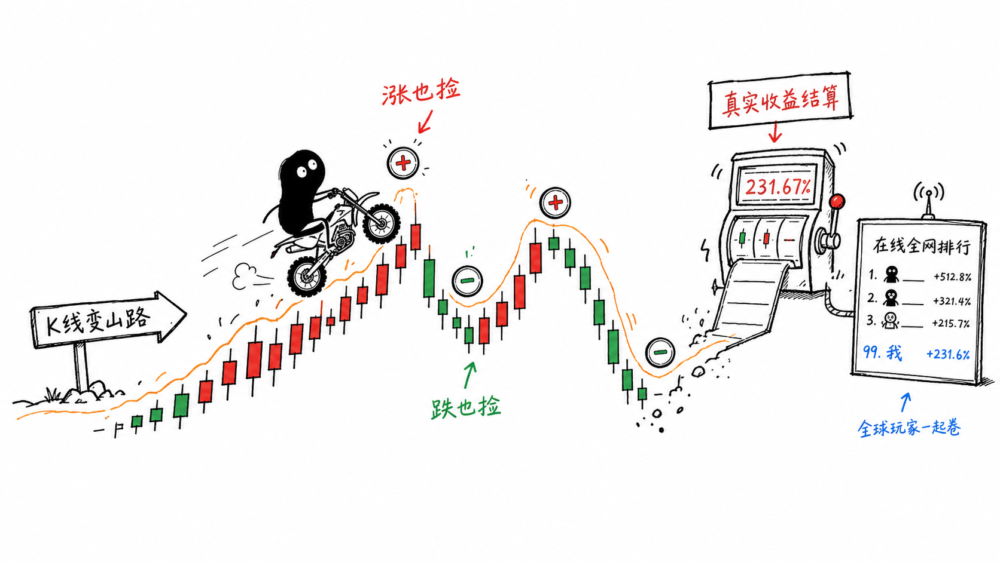

# 韭菜骑士 / Leek Knight

把真实 A 股近一年 K 线变成越野摩托赛道的浏览器物理游戏。

线上试玩：[https://leek-knight.pages.dev](https://leek-knight.pages.dev)

代码仓库：[https://github.com/vigorX777/leek-knight](https://github.com/vigorX777/leek-knight)



小黑把 A 股 K 线当山路骑：涨也捡，跌也捡，真实收益结算后冲进在线全网排行。

## 操作

- `W` / `↑`：加速
- `S` / `↓`：刹车，停车后继续按住可倒退
- `A` / `←`：翘头，抬起前轮
- `D` / `→`：下压车头
- `Space`：任一车轮着地时跳跃，速度越高跳得越远
- `R`：重新开始

## 本地运行

```bash
npm install
npm run dev
```

生产检查：

```bash
npm test
npm run build
npm run preview
```

刷新行情快照：

```bash
python3 -m venv .venv
.venv/bin/pip install akshare
.venv/bin/python scripts/fetch_stock_data.py
```

## 说明

游戏使用固定历史行情快照，运行时不连接券商、行情或交易系统。余额仅为玩法数值，不涉及真实资产，也不构成投资建议。

游戏内会显示后轮抓地、腾空、油门强度、双 Combo 和下一结算点，便于判断何时加速、跳跃、制动或调整重心。

摔车后不会结束本轮挑战，摩托会在当前路段原地复位并继续骑行。未吃到的金币会保留，可倒车重新拾取；每次结算都会触发居中金额滚动和爆发动画。

## 排行榜

通关整条赛道后可提交成绩到全球排行榜。排名基于总收益率，同一浏览器同一股票只保留最高成绩。

- 昵称限制为 2-12 个中英文、数字或下划线字符。
- 前端使用本地 `localStorage` UUID 作为匿名玩家 ID。
- 后端只接受固定快照中的 20 支股票和对应名称，避免任意代码污染榜单。
- 完整排行榜支持按股票筛选，并高亮当前浏览器玩家的成绩。

## 部署

项目可部署到 Cloudflare Pages。前端由 Pages 托管，`functions/api/leaderboard.js` 作为 Pages Functions API，排行榜数据存储在 Cloudflare D1。

### 首次部署

```bash
# 1. 安装 wrangler
npm install -g wrangler

# 2. 登录 Cloudflare
wrangler login

# 3. 创建 D1 数据库
wrangler d1 create leek-knight-db
# 将输出的 database_id 填入 wrangler.toml

# 4. 执行建表
wrangler d1 execute leek-knight-db --file=schema.sql

# 5. 构建并部署
npm run build
wrangler pages deploy dist/
```

### 本地验证 Pages Functions

```bash
npm run build
npx wrangler pages dev dist
```

然后测试接口：

```bash
curl -X POST http://localhost:8788/api/leaderboard \
  -H "Content-Type: application/json" \
  -d '{"stock_code":"600519","stock_name":"贵州茅台","player_name":"测试骑手","player_id":"00000000-0000-4000-8000-000000000001","initial":100000,"final":115000,"return_rate":0.15,"progress":1}'
```

### 更新部署

```bash
npm run build
wrangler pages deploy dist/
```
